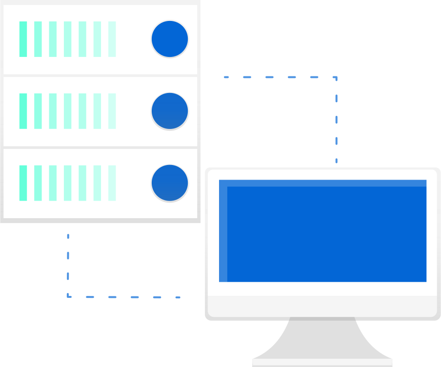

<div align="center">

<br />
<h1>Hello World gRPC-Gateway</h1>
<p>
Simple hello world program which uses gRPC-Gateway
</p>
<a href="https://github.com/iamrajiv/helloworld-grpc-gateway/network/members"></a>
<a href="https://github.com/iamrajiv/helloworld-grpc-gateway/stargazers"></a>
<a href="https://github.com/iamrajiv/helloworld-grpc-gateway/blob/main/LICENSE"></a>
</div>

## About

This project is a basic hello world program utilizing gRPC-Gateway. It was developed as part of my participation in [Google Season of Docs 2020](https://github.com/iamrajiv/GSoD-2020) with [gRPC-Gateway](https://github.com/grpc-ecosystem/grpc-gateway). The goal of this project is to introduce and familiarize individuals with gRPC-Gateway.

All the tutorials related to Hello World gRPC-Gateway have been added to the [gRPC-Gateway documentation website](https://grpc-ecosystem.github.io/grpc-gateway/docs/tutorials/).

The folder structure of the project is as follows:

```shell
.
├── LICENSE
├── Makefile
├── README.md
├── assets
│   └── helloworld-grpc-gateway.svg
├── buf.gen.yaml
├── buf.yaml
├── go.mod
├── go.sum
├── main.go
└── proto
    ├── google
    │   └── api
    │       ├── annotations.proto
    │       └── http.proto
    └── helloworld
        ├── hello_world.pb.go
        ├── hello_world.pb.gw.go
        ├── hello_world.proto
        ├── hello_world.swagger.json
        └── hello_world_grpc.pb.go
```

## Usage

#### Installation

Before running this project, we need to install the required Go packages. To do this, run the following command:

```shell
make install
```

#### Generating stubs

We can generate the stubs for the project using the following command:

```shell
make generate
```

#### Cleaning stubs

To delete the stubs, use the following command:

```shell
make clean
```

#### Running the server

To run the server, use the following command:

```shell
go run main.go
```

#### Sending HTTP Requests

To send an HTTP POST request to the server, use cURL with the following command:

```shell
curl -X POST -k http://localhost:8090/v1/example/echo -d '{"name": "hello"}'
```

The server will respond with the following message:

```shell
{"message":"hello world"}
```

Note that the server runs on port 8090 and the endpoint is `/v1/example/echo`. The `name` field in the request is used in the response message.

## Swagger UI

We can view and test the API using the Swagger UI at the following link: [https://app.swaggerhub.com/apis/iamrajiv/Hello_World_gRPC-Gateway/2](https://app.swaggerhub.com/apis/iamrajiv/Hello_World_gRPC-Gateway/2).

## License

[MIT](https://github.com/iamrajiv/helloworld-grpc-gateway/blob/main/LICENSE)
